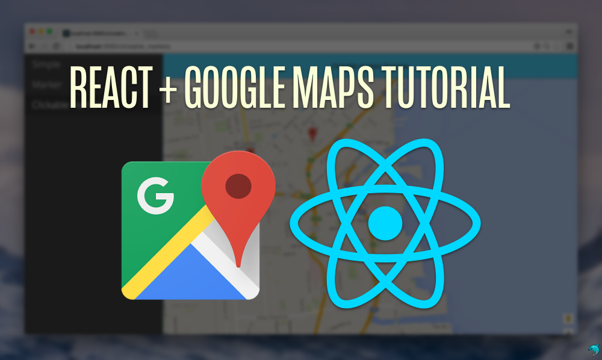
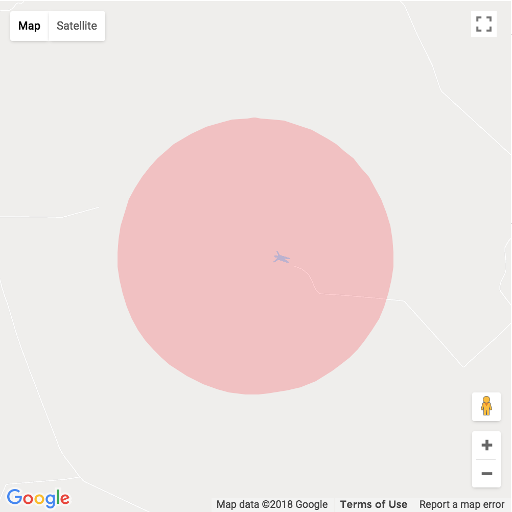

<p align="center">
  
</p>

# Google Map React Component Tutorial [](https://www.fullstackreact.com)

> A declarative Google Map React component using React, lazy-loading dependencies, current-location finder and a test-driven approach by the [Fullstack React](https://fullstackreact.com) team.

See the [demo](https://fullstackreact.github.io/google-maps-react) and [accompanying blog post](https://www.fullstackreact.com/articles/how-to-write-a-google-maps-react-component/).

## Quickstart

First, install the library:

```shell
npm install --save google-maps-react
```
## Automatically Lazy-loading Google API

The library includes a helper to wrap around the Google maps API. The `GoogleApiWrapper` Higher-Order component accepts a configuration object which *must* include an `apiKey`. See [lib/GoogleApi.js](https://github.com/fullstackreact/google-maps-react/blob/master/src/lib/GoogleApi.js#L4) for all options it accepts.

```javascript
import {GoogleApiWrapper} from 'google-maps-react';

// ...

export class MapContainer extends React.Component {}

export default GoogleApiWrapper({
  apiKey: (YOUR_GOOGLE_API_KEY_GOES_HERE)
})(MapContainer)
```

Alternatively, the `GoogleApiWrapper` Higher-Order component can be configured by passing a function that will be called with whe wrapped component's `props` and should returned the configuration object.

```javascript
export default GoogleApiWrapper(
  (props) => ({
    apiKey: props.apiKey,
    language: props.language,
  }
))(MapContainer)
```

If you want to add a loading container _other than the default_ loading container, simply pass it in the HOC, like so:

```javascript
const LoadingContainer = (props) => (
  <div>Fancy loading container!</div>
)

export default GoogleApiWrapper({
  apiKey: (YOUR_GOOGLE_API_KEY_GOES_HERE),
  LoadingContainer: LoadingContainer
})(MapContainer)
```

## Sample Usage With Lazy-loading Google API:

```javascript
import {Map, InfoWindow, Marker, GoogleApiWrapper} from 'google-maps-react';

export class MapContainer extends Component {
  render() {
    return (
      <Map google={this.props.google} zoom={14}>

        <Marker onClick={this.onMarkerClick}
                name={'Current location'} />

        <InfoWindow onClose={this.onInfoWindowClose}>
            <div>
              <h1>{this.state.selectedPlace.name}</h1>
            </div>
        </InfoWindow>
      </Map>
    );
  }
}

export default GoogleApiWrapper({
  apiKey: (YOUR_GOOGLE_API_KEY_GOES_HERE)
})(MapContainer)
```
*Note: [Marker](#marker) and [InfoWindow](#infowindow--sample-event-handler-functions) components are disscussed below.*


## Examples

Check out the example site at: [http://fullstackreact.github.io/google-maps-react](http://fullstackreact.github.io/basic)

## Additional Map Props
The Map component takes a number of optional props.

Zoom: (Shown Above) takes a number with the higher value representing a tighter focus on the map's center.

Style: Takes CSS style object - commonly width and height.

```javascript
const style = {
  width: '100%',
  height: '100%'
}
```

Container Style: Takes CSS style object - optional, commonly when you want to change from the default of position "absolute".

```javascript
const containerStyle = {
  position: 'relative',  
  width: '100%',
  height: '100%'
}
```

```javascript
    <Map
          containerStyle={containerStyle}
```

initialCenter: Takes an object containing latitude and longitude coordinates. Sets the maps center upon loading.

```javascript
    <Map
          google={this.props.google}
          style={style}
          initialCenter={{
            lat: 40.854885,
            lng: -88.081807
          }}
          zoom={15}
          onClick={this.onMapClicked}
        >
```
center: Takes an object containing latitude and longitude coordinates. Use this if you want to re-render the map after the initial render.

```javascript
    <Map
          google={this.props.google}
          style={style}
          center={{
            lat: 40.854885,
            lng: -88.081807
          }}
          zoom={15}
          onClick={this.onMapClicked}
        >
```
bounds:  Takes a [google.maps.LatLngBounds()](https://developers.google.com/maps/documentation/javascript/reference/3/#LatLngBounds) object to adjust the center and zoom of the map.
```javascript
var points = [
    { lat: 42.02, lng: -77.01 },
    { lat: 42.03, lng: -77.02 },
    { lat: 41.03, lng: -77.04 },
    { lat: 42.05, lng: -77.02 }
]
var bounds = new this.props.google.maps.LatLngBounds();
for (var i = 0; i < points.length; i++) {
  bounds.extend(points[i]);
}
return (
    <Map
        google={this.props.google}
        initialCenter={{
            lat: 42.39,
            lng: -72.52
        }}
        bounds={bounds}>
    </Map>
);

```

The following props are boolean values for map behavior:
`scrollwheel`, `draggable`, `keyboardShortcuts`, `disableDoubleClickZoom`

The following props are boolean values for presence of controls on the map:
`zoomControl`, `mapTypeControl`, `scaleControl`, `streetViewControl`, `panControl`, `rotateControl`, `fullscreenControl`

The following props are object values for control options such as placement of controls on the map:
`zoomControlOptions`, `mapTypeControlOptions`, `streetViewControlOptions`
See Google Maps [Controls](https://developers.google.com/maps/documentation/javascript/controls) for more information.


It also takes event handlers described below:

### Events

The `<Map />` component handles events out of the box. All event handlers are optional.

#### onReady

When the `<Map />` instance has been loaded and is ready on the page, it will call the `onReady` prop, if given. The `onReady` prop is useful for fetching places or using the autocomplete API for places.

```javascript
fetchPlaces(mapProps, map) {
  const {google} = mapProps;
  const service = new google.maps.places.PlacesService(map);
  // ...
}

render() {
  return (
    <Map google={this.props.google}
      onReady={this.fetchPlaces}
      visible={false}>
        <Listing places={this.state.places} />
    </Map>
  )
}
```

#### onClick

To listen for clicks on the `<Map />` component, pass the `onClick` prop:

```javascript
mapClicked(mapProps, map, clickEvent) {
  // ...
}

render() {
  return (
    <Map google={this.props.google}
      onClick={this.mapClicked} />
  )
}
```

#### onDragend

When our user changes the map center by dragging the Map around, we can get a callback after the event is fired with the `onDragend` prop:

```javascript
centerMoved(mapProps, map) {
  // ...
}

render() {
  return (
    <Map google={this.props.google}
      onDragend={this.centerMoved} />
  )
}
```

The `<Map />` component also listens to `onRecenter`, `onBounds_changed`, `onCenter_changed`, `onDblclick`, `onDragstart`, `onHeading_change`, `onIdle`, `onMaptypeid_changed`, `onMousemove`, `onMouseout`, `onMouseover`, `onProjection_changed`, `onResize`, `onRightclick`, `onTilesloaded`, `onTilt_changed`, and `onZoom_changed` events. See Google Maps [Events](https://developers.google.com/maps/documentation/javascript/events) for more information.

### Visibility

You can control the visibility of the map by using the `visible` prop. This is useful for situations when you want to use the Google Maps API without a map. The `<Map />` component will load like normal. See the [Google places demo](https://fullstackreact.github.io/google-maps-react/#/places)

For example:

```javascript
<Map google={this.props.google}
    visible={false}>
  <Listing places={this.state.places} />
</Map>
```

## Subcomponents

The `<Map />` api includes subcomponents intended on being used as children of the `Map` component. Any child can be used within the `Map` component and will receive the three `props` (as children):

* `map` - the Google instance of the `map`
* `google` - a reference to the `window.google` object
* `mapCenter` - the `google.maps.LatLng()` object referring to the center of the map instance

### Marker

To place a marker on the Map, include it as a child of the `<Map />` component.

```javascript
<Map google={this.props.google}
    style={{width: '100%', height: '100%', position: 'relative'}}
    className={'map'}
    zoom={14}>
  <Marker
    title={'The marker`s title will appear as a tooltip.'}
    name={'SOMA'}
    position={{lat: 37.778519, lng: -122.405640}} />
  <Marker
    name={'Dolores park'}
    position={{lat: 37.759703, lng: -122.428093}} />
  <Marker />
  <Marker
    name={'Your position'}
    position={{lat: 37.762391, lng: -122.439192}}
    icon={{
      url: "/path/to/custom_icon.png",
      anchor: new google.maps.Point(32,32),
      scaledSize: new google.maps.Size(64,64)
    }} />
</Map>
```

The `<Marker />` component accepts a `position` prop that defines the location for the `position` on the map. It can be either a raw object or a `google.maps.LatLng()` instance.

If no `position` is passed in the `props`, the marker will default to the current position of the map, i.e. the `mapCenter` prop.

You can also pass any other `props` you want with the `<Marker />`. It will be passed back through marker events.

The marker component can also accept a child InfoMarker component for situations where there is only 1 marker and 1 infowindow.

```javascript
<Marker
  title="Location"
  id={1}
  position={markerCenter}
  draggable={true}
  onDragend={this.moveMarker.bind(this)}
  >
  <InfoWindow
    visible={showInfoWindow}
    style={styles.infoWindow}
    >
      <div className={classes.infoWindow}>
        <p>Click on the map or drag the marker to select location where the incident occurred</p>
      </div>
  </InfoWindow>
</Marker>
```

### Events

The `<Marker />` component listens for events, similar to the `<Map />` component.

#### onClick

You can listen for an `onClick` event with the (appropriately named) `onClick` prop.

```javascript
onMarkerClick(props, marker, e) {
  // ..
}

render() {
  return (
    <Map google={this.props.google}>
      <Marker onClick={this.onMarkerClick}
          name={'Current location'} />
    </Map>
  )
}
```

#### mouseover

You can also pass a callback when the user mouses over a `<Marker />` instance by passing the `onMouseover` callback:

```javascript
onMouseoverMarker(props, marker, e) {
  // ..
}

render() {
  return (
    <Map google={this.props.google}>
      <Marker onMouseover={this.onMouseoverMarker}
          name={'Current location'} />
    </Map>
  )
}
```

### Polygon

To place a polygon on the Map, set `<Polygon />` as child of Map component.

```javascript
render() {
  const triangleCoords = [
    {lat: 25.774, lng: -80.190},
    {lat: 18.466, lng: -66.118},
    {lat: 32.321, lng: -64.757},
    {lat: 25.774, lng: -80.190}
  ];

  return(
    <Map google={this.props.google}
        style={{width: '100%', height: '100%', position: 'relative'}}
        className={'map'}
        zoom={14}>
        <Polygon
          paths={triangleCoords}
          strokeColor="#0000FF"
          strokeOpacity={0.8}
          strokeWeight={2}
          fillColor="#0000FF"
          fillOpacity={0.35} />
    </Map>
  )
}
```

#### Events

The `<Polygon />` component listens to `onClick`, `onMouseover` and `onMouseout` events.

### Polyline

To place a polyline on the Map, set `<Polyline />` as child of Map component.

```javascript
render() {
  const triangleCoords = [
    {lat: 25.774, lng: -80.190},
    {lat: 18.466, lng: -66.118},
    {lat: 32.321, lng: -64.757},
    {lat: 25.774, lng: -80.190}
  ];

  return(
    <Map google={this.props.google}
        style={{width: '100%', height: '100%', position: 'relative'}}
        className={'map'}
        zoom={14}>
        <Polyline
          path={triangleCoords}
          strokeColor="#0000FF"
          strokeOpacity={0.8}
          strokeWeight={2} />
    </Map>
  )
}
```

#### Events

The `<Polyline />` component listens to `onClick`, `onMouseover` and `onMouseout` events.

### InfoWindow

The `<InfoWindow />` component included in this library is gives us the ability to pop up a "more info" window on our Google map.


The visibility of the `<InfoWindow />` component is controlled by a `visible` prop. The `visible` prop is a boolean (`PropTypes.bool`) that shows the `<InfoWindow />` when true and hides it when false.

There are two ways how to control a position of the `<InfoWindow />` component.
You can use a `position` prop or connect the `<InfoWindow />` component directly to an existing `<Marker />` component by using a `marker` prop.

```javascript
//note: code formatted for ES6 here
export class MapContainer extends Component {
  state = {
    showingInfoWindow: false,
    activeMarker: {},
    selectedPlace: {},
  };

  onMarkerClick = (props, marker, e) =>
    this.setState({
      selectedPlace: props,
      activeMarker: marker,
      showingInfoWindow: true
    });

  onMapClicked = (props) => {
    if (this.state.showingInfoWindow) {
      this.setState({
        showingInfoWindow: false,
        activeMarker: null
      })
    }
  };

  render() {
    return (
      <Map google={this.props.google}
          onClick={this.onMapClicked}>
        <Marker onClick={this.onMarkerClick}
                name={'Current location'} />

        <InfoWindow
          marker={this.state.activeMarker}
          visible={this.state.showingInfoWindow}>
            <div>
              <h1>{this.state.selectedPlace.name}</h1>
            </div>
        </InfoWindow>
      </Map>
    )
  }
}
```

### Events

The `<InfoWindow />` throws events when it's showing/hiding. Every event is optional and can accept a handler to be called when the event is fired.

```javascript
<InfoWindow
  onOpen={this.windowHasOpened}
  onClose={this.windowHasClosed}
  visible={this.state.showingInfoWindow}>
    <div>
      <h1>{this.state.selectedPlace.name}</h1>
    </div>
</InfoWindow>
```

#### onClose

The `onClose` event is fired when the `<InfoWindow />` has been closed. It's useful for changing state in the parent component to keep track of the state of the `<InfoWindow />`.

#### onOpen

The `onOpen` event is fired when the window has been mounted in the Google map instance. It's useful for keeping track of the state of the `<InfoWindow />` from within the parent component.

### Circle



To place a circle on the Map, set `<Circle />` as child of Map component.

```javascript
render() {
  const coords = { lat: -21.805149, lng: -49.0921657 };

  return (
    <Map
      initialCenter={coords}
      google={this.props.google}
      style={{width: 500, height: 500, position: 'relative'}}
      zoom={14}
    >
      <Circle
        radius={1200}
        center={coords}
        onMouseover={() => console.log('mouseover')}
        onClick={() => console.log('click')}
        onMouseout={() => console.log('mouseout')}
        strokeColor='transparent'
        strokeOpacity={0}
        strokeWeight={5}
        fillColor='#FF0000'
        fillOpacity={0.2}
      />
    </Map>
  );
}
```

#### Events

The `<Circle />` component listens to `onClick`, `onMouseover` and `onMouseout` events.

The `GoogleApiWrapper` automatically passes the `google` instance loaded when the component mounts (and will only load it once).

#### Custom Map Style

To set your own custom map style, import your custom map style in JSON format.

```javascript
const mapStyle = [
  {
    featureType: 'landscape.man_made',
    elementType: 'geometry.fill',
    stylers: [
      {
        color: '#dceafa'
      }
    ]
  },
  ]

 _mapLoaded(mapProps, map) {
    map.setOptions({
       styles: mapStyle
    })
 }

render() {
  return (
    <Map
      style={style}
      google={this.props.google}
      zoom={this.state.zoom}
      initialCenter={this.state.center}
      onReady={(mapProps, map) => this._mapLoaded(mapProps, map)}
    >
      ...
    </Map>
   );
 }
      
```

## Manually loading the Google API

If you prefer not to use the automatic loading option, you can also pass the `window.google` instance as a `prop` to your `<Map />` component.

```javascript
<Map google={window.google} />
```

## Issues?

If you have some issues, please make an issue on the issues tab and try to include an example. We've had success with https://codesandbox.io

An example template might look like: [https://codesandbox.io/s/rzwrk2854](https://codesandbox.io/s/rzwrk2854)

## Contributing

```shell
git clone https://github.com/fullstackreact/google-maps-react.git
cd google-maps-react
npm install
make dev
```

The Google Map React component library uses React and the Google API to give easy access to the Google Maps library.

___

# Fullstack React Book

<a href="https://fullstackreact.com">

</a>

This Google Map React component library was built alongside the blog post [How to Write a Google Maps React Component](https://www.fullstackreact.com/articles/how-to-write-a-google-maps-react-component/).

This repo was written and is maintained by the [Fullstack React](https://fullstackreact.com) team. In the book we cover many more projects like this. We walk through each line of code, explain why it's there and how it works.

This app is only one of several apps we have in the book. If you're looking to learn React, there's no faster way than by spending a few hours with the Fullstack React book.

<div style="clear:both"></div>

## License
 [MIT](/LICENSE)
